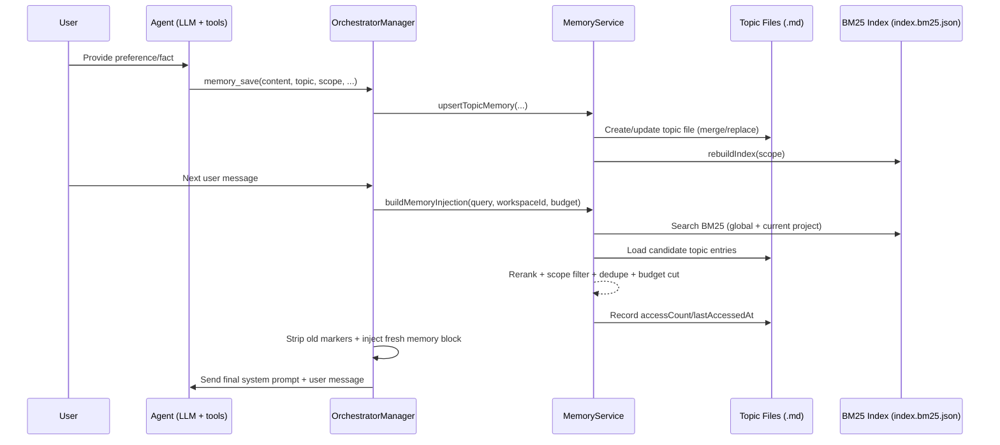

# Nuvin Memory System Lifecycle (Scoped Frontmatter + BM25)

This document explains the full lifecycle of long-term memory in Nuvin CLI:

1. how memory is saved
2. when and how memory is updated
3. how memory becomes available to the LLM
4. what changed from the legacy memory model

## 1) Core Design

Nuvin memory is built around three principles:

- Scope safety: retrieve only `global` and current workspace `project` memory.
- Topic-centric storage: one markdown file per topic with YAML frontmatter.
- Retrieval-time injection: search and inject only relevant memory under a token budget.

## 2) Memory Scopes and Isolation

Nuvin resolves workspace context at runtime:

- `workspaceRoot`: git top-level (or current directory fallback)
- `workspaceId`: stable hash derived from `workspaceRoot`

Memory retrieval is limited to:

1. global scope
2. project scope for the current `workspaceId`

Project memories from other workspaces are filtered out during retrieval.

## 3) Storage Layout and Schema

### File locations

- Global topic memories:
  - `~/.nuvin[-profile]/memory/global/topics/<topic-slug>.md`
- Project topic memories:
  - `<workspaceRoot>/.nuvin/memory/project/topics/<topic-slug>.md`

### BM25 sidecar indexes

- Global index:
  - `~/.nuvin[-profile]/memory/global/index.bm25.json`
- Project index:
  - `<workspaceRoot>/.nuvin/memory/project/index.bm25.json`

### Topic file structure

Each topic file stores metadata in frontmatter and facts/rules/notes in markdown body.

```md
---
id: mem_topic_<id>
topic: typescript-formatting
title: TypeScript Formatting Preferences
scope: project
workspaceId: ws_<hash>
type: semantic
keywords:
  - typescript
  - formatting
tags:
  - typescript
  - formatting
source: explicit
createdAt: 2026-02-28T10:00:00.000Z
updatedAt: 2026-02-28T10:00:00.000Z
accessCount: 0
lastAccessedAt: 2026-02-28T10:00:00.000Z
version: 1
---

- Prefer single quotes.
- Prefer 2-space indentation.
```

## 4) Save Lifecycle

Memory enters the system through two paths.

### Path A: Explicit save (`memory_save` tool)

The agent calls `memory_save` when it identifies durable information.

Current contract:

- required: `content`, `type`, `scope`, `topic`
- optional: `title`, `tags`, `keywords`, `updateMode`

`OrchestratorManager` forwards this to `MemoryService.upsertTopicMemory(...)` with `source: explicit`.

### Path B: Background extraction

After a successful turn, Nuvin may run memory extraction in background when:

- memory is enabled
- `memory.backgroundExtraction !== false`
- `NUVIN_MEMORY_EXTRACTION=1`

Extraction behavior:

1. read recent conversation messages
2. ask `MemoryExtractor` to produce candidates
3. save candidates with `source: extracted`
4. default extracted scope is `project`

## 5) Update Lifecycle (When Memory Changes)

Memory is updated in these cases:

1. Explicit `memory_save` call
2. Background extraction writes
3. Retrieval injection access tracking
4. Deletion / clear operations
5. Migration from legacy JSON

### Upsert behavior (topic key)

Upsert key is topic slug within scope directory.

- If topic does not exist: create file
- If topic exists:
  - `merge` mode: dedupe + append normalized lines
  - `replace` mode: replace body content

Metadata updates on write:

- `updatedAt` always refreshed
- `createdAt` preserved for existing topic
- `keywords` / `tags` normalized and deduplicated
- `workspaceId` attached to project memories

### Access updates during retrieval

When an entry is selected for injection, Nuvin updates:

- `accessCount += 1`
- `lastAccessedAt = now`
- `updatedAt = now`

This keeps ranking adaptive over time.

## 6) Retrieval Lifecycle (Per Turn)

On each `send()` call, before LLM completion:

1. Build query text from user input
2. Search memories with BM25 in allowed scopes
3. Filter project entries by current `workspaceId`
4. Rerank with combined score:
   - normalized BM25 relevance
   - recency decay
   - access frequency
   - memory-type weight
   - small project boost
5. Deduplicate by topic
6. If same topic exists in global + project, prefer project
7. Select entries under `injectTokenBudget`

Result: a compact memory packet grouped by type.

## 7) How Memory Becomes Available to the LLM

This is the critical path from storage to model context.

### Step-by-step prompt integration

1. `OrchestratorManager.send()` calls `buildMemoryInjection(...)`
2. `MemoryService` returns a token-budgeted memory block
3. Existing memory section is stripped from system prompt
4. Fresh memory section is inserted using idempotent markers:
   - `<!-- nuvin:memory:start -->`
   - `<!-- nuvin:memory:end -->`
5. Updated system prompt is passed to orchestrator for the LLM call

This guarantees:

- no duplicate memory sections across turns
- fresh retrieval every turn
- memory context stays bounded

## 7.1) Lifecycle Sequence (Save -> Index -> Retrieve -> Inject)



## 8) Startup and Migration Lifecycle

On `MemoryService` initialization:

1. ensure scope directories exist
2. auto-migrate legacy `memories.json` if topic files are absent
3. build/rebuild BM25 index sidecars

Migration behavior:

- read legacy JSON entries
- infer topic when missing
- upsert into frontmatter topic files
- backup legacy file as `memories.json.bak.<timestamp>`
- best effort: invalid entries are skipped

## 9) Operational Lifecycle (Maintenance APIs)

- `getAllMemories()`: read all topic files in configured scopes
- `deleteMemory(id)`: remove matching topic file and rebuild index
- `clearMemories(scope?)`: remove topic dirs and index files by scope
- `rebuildIndex(scope, workspaceId?)`: force index rebuild

## 10) Enhancements vs Legacy Model

Compared to old JSON-entry memory, the current model adds:

1. Better structure
- from flat entries to topic documents with frontmatter metadata

2. Better retrieval quality
- BM25 ranking + rerank signals instead of broad/plain memory inclusion

3. Strict scope safety
- hard filter for current workspace project memory

4. Better context efficiency
- token-budgeted injection instead of dumping large memory sets

5. Better prompt hygiene
- idempotent injection markers prevent duplicate accumulation

6. Better long-term adaptability
- access-based and recency-based scoring feedback loop

7. Better compatibility and migration
- automatic migration from legacy `memories.json`
- compatibility wrapper for existing `addMemory(...)` callers

## 11) Configuration Controls

```yaml
memory:
  enabled: true
  saveTool: true
  backgroundExtraction: true
  storage:
    format: frontmatter-topic-md
  retrieval:
    engine: bm25
    candidateLimit: 40
    injectTokenBudget: 1200
  index:
    persisted: true
```

Important effects:

- `memory.enabled: false` disables memory service and retrieval/injection.
- `memory.saveTool: false` removes `memory_save` from enabled tools.
- `memory.retrieval.injectTokenBudget` controls max injected memory size.
- `memory.index.persisted` controls sidecar index persistence.

## 12) Practical End-to-End Example

User says: "In this repo, always use pnpm and single quotes."

1. Agent calls `memory_save`:
   - `scope: project`
   - `topic: toolchain-style`
   - `type: procedural`
2. Nuvin upserts topic file in current workspace project memory.
3. Project BM25 index is rebuilt/updated.
4. Next turn in same workspace:
   - retrieval finds `toolchain-style`
   - memory block injected into system prompt
   - LLM responds with those conventions in mind.
5. In a different workspace:
   - that project memory is not retrieved
   - only global + that workspace project memories are visible.
