# Tool Call Flow Documentation

## Overview

This document describes the complete tool call flow in nuvin-cli, from user message submission to tool execution and result resubmission to the LLM.

## Sequence Diagram

```mermaid
sequenceDiagram
    autonumber
    participant User
    participant InputArea
    participant useHandleSubmit
    participant App
    participant OrchestratorManager
    participant AgentOrchestrator
    participant LLM
    participant ToolRegistry
    participant EventBus
    participant ToolApprovalContext
    participant ToolApprovalPrompt

    %% Phase 1: User Input Submission
    rect rgb(230, 245, 255)
        Note over User, App: Phase 1: User Input Submission
        User->>InputArea: Type message + Enter
        InputArea->>useHandleSubmit: handleInputSubmit(input)
        alt Input starts with "/"
            useHandleSubmit->>useHandleSubmit: Execute command
        else Normal message
            useHandleSubmit->>App: processMessage(submission)
            App->>App: appendLine(user message)
            App->>App: setBusy(true)
        end
    end

    %% Phase 2: LLM Interaction
    rect rgb(255, 245, 230)
        Note over App, LLM: Phase 2: LLM Interaction
        App->>OrchestratorManager: send(submission, opts)
        OrchestratorManager->>OrchestratorManager: createLLM() - fresh instance
        OrchestratorManager->>AgentOrchestrator: send(content, opts)
        AgentOrchestrator->>AgentOrchestrator: Build conversation context
        
        alt Streaming enabled
            AgentOrchestrator->>LLM: streamCompletion(params, callbacks)
            loop Streaming chunks
                LLM-->>AgentOrchestrator: onChunk(delta, usage)
                AgentOrchestrator-->>EventBus: emit(AssistantChunk)
            end
            LLM-->>AgentOrchestrator: onStreamFinish(finishReason, usage)
        else Non-streaming
            AgentOrchestrator->>LLM: generateCompletion(params)
            LLM-->>AgentOrchestrator: CompletionResult
        end
    end

    %% Phase 3: Tool Call Detection
    rect rgb(245, 255, 230)
        Note over AgentOrchestrator, ToolApprovalPrompt: Phase 3: Tool Call Detection & Approval
        AgentOrchestrator->>AgentOrchestrator: Check result.tool_calls
        
        alt Has tool_calls
            AgentOrchestrator->>AgentOrchestrator: enrichToolCalls (add approvalId)
            AgentOrchestrator->>AgentOrchestrator: Pre-register pendingApprovals map
            Note over AgentOrchestrator: CRITICAL: Register approvals BEFORE emit
            AgentOrchestrator-->>EventBus: emit(ToolCalls)
            EventBus-->>ToolApprovalContext: onToolCalls(enrichedToolCalls)
            
            loop For each tool
                alt Tool bypasses approval (read-only/todo)
                    ToolApprovalContext->>ToolApprovalContext: Skip approval
                else Tool requires approval
                    alt Session-approved tool
                        ToolApprovalContext->>AgentOrchestrator: handleToolApproval(id, 'approve')
                    else Needs user approval
                        ToolApprovalContext->>ToolApprovalPrompt: Add to pendingApprovalTools
                        ToolApprovalPrompt->>User: Show approval modal (always index 0)
                        Note over ToolApprovalPrompt: Array shrinks after each approval
                        
                        alt User approves
                            User->>ToolApprovalPrompt: Click "Yes"
                            ToolApprovalPrompt->>AgentOrchestrator: handleToolApproval(id, 'approve')
                        else User denies
                            User->>ToolApprovalPrompt: Click "No"
                            ToolApprovalPrompt->>AgentOrchestrator: handleToolApproval(id, 'deny')
                        else User approves for session
                            User->>ToolApprovalPrompt: Click "Yes for session"
                            ToolApprovalPrompt->>ToolApprovalContext: addSessionApprovedTool(name)
                            ToolApprovalPrompt->>AgentOrchestrator: handleToolApproval(id, 'approve') for all same-name tools
                        else User provides edit instruction
                            User->>ToolApprovalPrompt: Enter edit instruction
                            ToolApprovalPrompt->>AgentOrchestrator: handleToolApproval(id, 'edit', instruction)
                        end
                    end
                end
            end
        end
    end

    %% Phase 4: Tool Execution
    rect rgb(255, 230, 245)
        Note over AgentOrchestrator, ToolRegistry: Phase 4: Tool Execution
        AgentOrchestrator->>AgentOrchestrator: processToolApproval()
        
        par Execute tools in parallel
            AgentOrchestrator->>AgentOrchestrator: executeToolWithApproval(tool1)
            AgentOrchestrator->>AgentOrchestrator: executeToolWithApproval(tool2)
        end
        
        loop For each tool
            alt Approval granted
                AgentOrchestrator->>ToolRegistry: executeToolCalls([toolCall])
                
                alt Tool exists
                    ToolRegistry->>ToolRegistry: tool.execute(params, context)
                    
                    alt Execution success
                        ToolRegistry-->>AgentOrchestrator: ToolExecutionResult (success)
                    else Execution error
                        ToolRegistry-->>AgentOrchestrator: ToolExecutionResult (error)
                    else Aborted
                        ToolRegistry-->>AgentOrchestrator: ToolExecutionResult (aborted)
                    end
                else Tool not found
                    ToolRegistry-->>AgentOrchestrator: Error: tool not found
                end
                
                AgentOrchestrator-->>EventBus: emit(ToolResult)
            else Approval denied
                AgentOrchestrator->>AgentOrchestrator: Return denied result
                AgentOrchestrator-->>EventBus: emit(ToolResult - denied)
            end
        end
    end

    %% Phase 5: Result Resubmission
    rect rgb(245, 230, 255)
        Note over AgentOrchestrator, LLM: Phase 5: Result Resubmission
        AgentOrchestrator->>AgentOrchestrator: Build assistant message (with tool_calls)
        AgentOrchestrator->>AgentOrchestrator: Build tool result messages
        AgentOrchestrator->>AgentOrchestrator: memory.append(messages)
        AgentOrchestrator->>AgentOrchestrator: Update accumulatedMessages
        
        alt All tools denied
            AgentOrchestrator->>AgentOrchestrator: Break loop, return denial message
        else Has results to submit
            AgentOrchestrator->>LLM: streamCompletion(with tool results)
            Note over AgentOrchestrator, LLM: Loop continues until no more tool_calls
        end
    end

    %% Phase 6: Final Response
    rect rgb(230, 255, 245)
        Note over AgentOrchestrator, User: Phase 6: Final Response
        AgentOrchestrator-->>EventBus: emit(AssistantMessage)
        AgentOrchestrator-->>EventBus: emit(Done)
        EventBus-->>App: Update UI with final message
        App->>App: setBusy(false)
        App->>User: Display response
    end
```



## Flow Phases

### Phase 1: User Input Submission

| Component | File | Description |
|-----------|------|-------------|
| InputArea | `components/InputArea.tsx` | Captures user input |
| useHandleSubmit | `hooks/useHandleSubmit.ts` | Routes input (command vs message) |
| App | `app.tsx` | Processes message, sets busy state |

**Entry Flow:**
1. User types message and presses Enter
2. `InputArea` calls `handleInputSubmit(input)`
3. `useHandleSubmit` checks if input starts with `/` (command) or is a message
4. For messages: calls `processMessage(submission)` which appends user line and sets busy state

### Phase 2: LLM Interaction

| Component | File | Description |
|-----------|------|-------------|
| OrchestratorManager | `services/OrchestratorManager.ts` | Session management, LLM creation |
| AgentOrchestrator | `nuvin-core/src/orchestrator.ts` | Core orchestration logic |
| LLM | `nuvin-core/src/llm/*.ts` | Provider-specific implementations |

**LLM Call Flow:**
1. `OrchestratorManager.send()` creates fresh LLM instance
2. `AgentOrchestrator.send()` builds conversation context from memory
3. **Streaming branch**: `LLM.streamCompletion()` with `onChunk`, `onReasoningChunk`, `onStreamFinish` callbacks
4. **Non-streaming branch**: `LLM.generateCompletion()` returns complete result

### Phase 3: Tool Call Detection & Approval

| Component | File | Description |
|-----------|------|-------------|
| AgentOrchestrator | `nuvin-core/src/orchestrator.ts:612-665` | Detects, enriches, and pre-registers approvals |
| ToolApprovalContext | `contexts/ToolApprovalContext.tsx` | Manages approval state, tracks batch total |
| ToolApprovalPrompt | `components/ToolApprovalPrompt/` | Approval UI (always shows first pending tool) |

**Critical Ordering (Race Condition Prevention):**
1. Enrich tool calls with `approvalId`
2. **Pre-register all approvals in `pendingApprovals` map** ← Must happen BEFORE emit
3. Emit `ToolCalls` event to UI
4. UI can now safely call `handleToolApproval()` (approvals are already registered)

**Bypass Approval Tools:**
- `file_read`, `ls_tool`, `web_search`, `web_fetch`, `glob_tool`, `grep_tool`
- `todo_write`, `todo_read`

**Approval UI Behavior:**
- Always displays tool at index 0 of `pendingApprovalTools` array
- When tool is approved/denied, it's removed from array (array shrinks)
- Next tool automatically becomes index 0
- Progress tracked via `pendingApprovalBatchTotal` (original count) minus remaining

**Approval Decisions:**
| Decision | Action |
|----------|--------|
| Approve | Execute tool immediately |
| Deny | Return denied result, skip execution |
| Approve Session | Add to session-approved list, auto-approve ALL same-name tools in current batch |
| Edit | Attach edit instruction to tool call |

### Phase 4: Tool Execution

| Component | File | Description |
|-----------|------|-------------|
| processToolApproval | `orchestrator.ts:278-430` | Parallel execution with pre-registered approval promises |
| ToolRegistry | `nuvin-core/src/tools.ts` | Tool lookup and execution |

**Execution Flow:**
1. Approval promises created upfront (before `ToolCalls` event)
2. Tools execute in parallel via `Promise.all`
3. Each tool awaits its pre-created approval promise (if required)
4. `ToolRegistry.executeToolCalls()` looks up and executes tool
5. Results emitted immediately via `ToolResult` event

**Execution Results:**
| Status | Cause |
|--------|-------|
| Success | Tool executed normally |
| Error | Tool threw exception or returned error |
| Aborted | Signal was aborted |
| Denied | User denied approval |

### Phase 5: Result Resubmission

| Component | File | Description |
|-----------|------|-------------|
| AgentOrchestrator | `orchestrator.ts:420-508` | Message building and resubmission |

**Message Building:**
1. Create assistant message with `tool_calls` array
2. Create tool result messages (role: 'tool')
3. Append all messages to memory
4. Update `accumulatedMessages` for next LLM call

**Loop Continuation:**
- If LLM returns more `tool_calls`: repeat phases 3-5
- If no `tool_calls`: proceed to final response
- If all tools denied: break loop, emit denial message

### Phase 6: Final Response

| Event | Description |
|-------|-------------|
| AssistantMessage | Final text response from LLM |
| Done | Conversation turn complete |

## Event Types

```typescript
const AgentEventTypes = {
  MessageStarted: 'message_started',
  ToolCalls: 'tool_calls',
  ToolResult: 'tool_result',
  ReasoningChunk: 'reasoning_chunk',
  AssistantChunk: 'assistant_chunk',
  AssistantMessage: 'assistant_message',
  StreamFinish: 'stream_finish',
  Done: 'done',
  Error: 'error',
  SubAgentStarted: 'sub_agent_started',
  SubAgentCompleted: 'sub_agent_completed',
};
```

## Branch Summary

| Branch | Condition | Outcome |
|--------|-----------|---------|
| Command vs Message | Input starts with `/` | Command execution vs LLM call |
| Streaming vs Non-streaming | `opts.stream` flag | Chunk events vs single completion |
| Bypass vs Requires Approval | Tool in bypass list | Immediate execution vs wait for approval |
| Session-approved | Tool name in session list | Auto-approve |
| Approval Decision | User choice | Approve/Deny/Session/Edit |
| Tool Exists | Tool in registry | Execute vs error |
| Execution Result | Tool behavior | Success/Error/Aborted |
| More Tool Calls | `result.tool_calls?.length` | Loop continues vs final response |
| All Denied | Every tool denied | Break loop with denial message |

## Key Files Reference

| File | Purpose |
|------|---------|
| `packages/nuvin-cli/source/app.tsx` | Main React app, processMessage |
| `packages/nuvin-cli/source/hooks/useHandleSubmit.ts` | Input handling |
| `packages/nuvin-cli/source/hooks/useOrchestrator.ts` | Orchestrator hook |
| `packages/nuvin-cli/source/services/OrchestratorManager.ts` | Session management |
| `packages/nuvin-cli/source/services/EventBus.ts` | Event pub/sub |
| `packages/nuvin-cli/source/contexts/ToolApprovalContext.tsx` | Approval state |
| `packages/nuvin-cli/source/components/ToolApprovalPrompt/` | Approval UI |
| `packages/nuvin-cli/source/adapters/ui-event-adapter.tsx` | Event to UI mapping |
| `packages/nuvin-cli/source/utils/eventProcessor.ts` | Event state machine |
| `packages/nuvin-core/src/orchestrator.ts` | Core orchestration |
| `packages/nuvin-core/src/tools.ts` | Tool registry |
| `packages/nuvin-core/src/ports.ts` | Type definitions |
